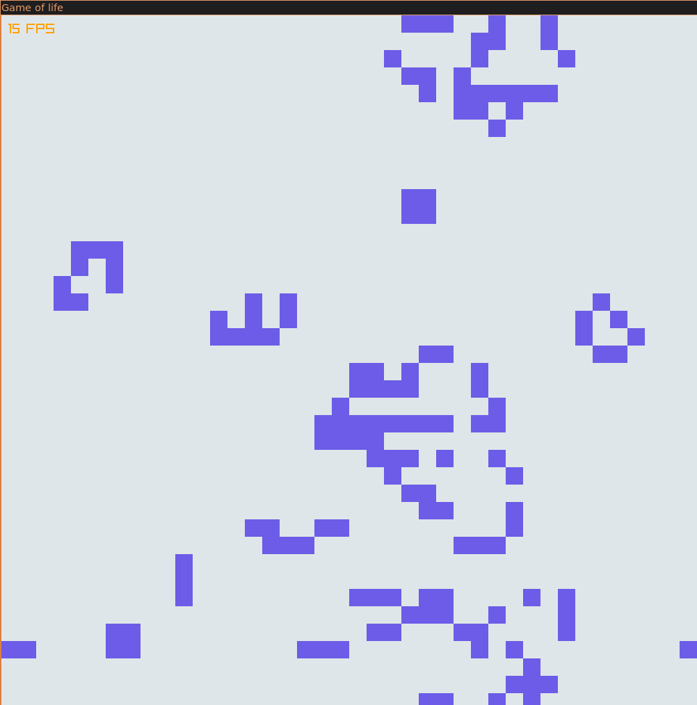
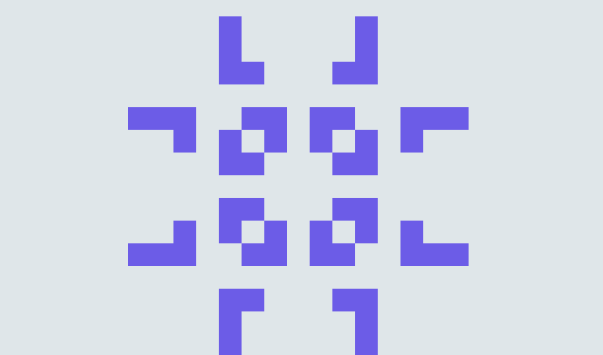

# Game of life


## Rules
The game evolution is determined by simple rules applied on each cells. 
1. Any live cell with fewer than 2 live Neighbors dies. **Underpopulation**
2. Any live cell with more than three live neighbours dies **Overpopulation**
3. Any dead cell with 3 neighbors respawns **Reproduction**
4. Any live cell with 2 or 3 live neighbors lives **Normal life**

## Demo
To run it, you'll need the Raylib library installed. [HOW TO](https://github.com/raysan5/raylib/wiki/Working-on-GNU-Linux)

Just run ```make run``` command to build and launch the programm.

### Random game


### Fun patern that appeared (a lot more on the wikipedia page)



## Sources
[Wikipedia](https://en.wikipedia.org/wiki/Conway%27s_Game_of_Life)
[Video - Coding Train](https://www.youtube.com/watch?v=FWSR_7kZuYg)
[Raylib - Graphics Library](www.raylib.com)


